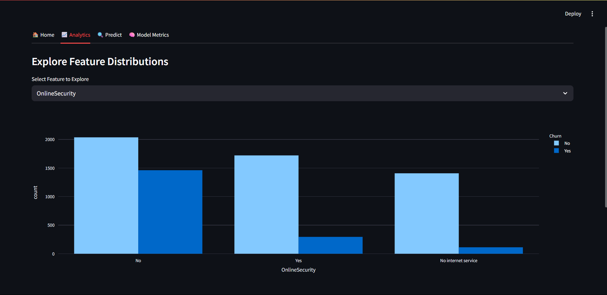
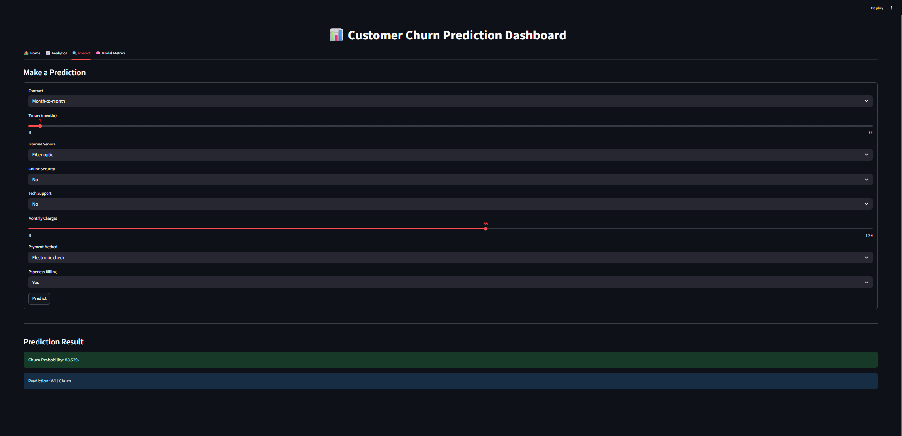

# 📉 Customer Churn Prediction App

An interactive **Streamlit web app** that predicts customer churn using a trained **XGBoost classifier** on the Telco Churn dataset. The app allows users to:
- Explore churn distribution & customer insights
- View model metrics
- Make predictions from user input
- Visualize churn drivers and feature importance

---

🧠 Model Used
- **XGBoost Classifier**
- Preprocessed using pipelines (`OneHotEncoder`, `StandardScaler`)
- Trained on a cleaned version of the [Hugging Face Churn dataset](https://huggingface.co/datasets/scikit-learn/churn-prediction)  
- Performance evaluated on metrics: Accuracy, Precision, Recall, F1-score.

---

🖥️ Features

| Tab | Description |
|-----|-------------|
| 📊 **Dashboard** | Overview of customer churn distribution, demographics & service stats |
| 📈 **Visual Insights** | Bar, histogram, and box plots showing churn patterns |
| 📋 **Model Metrics** | View performance metrics of the trained model |
| 🔍 **Predict Churn** | Enter customer details and predict churn status instantly |

---

📂 Folder Structure
```
├── dataset/
│   └── churn_new_dataset.csv
│
├── models/
│   ├── xgb.pkl
│   ├── rf.pkl
│   ├── lr.pkl
│   └── model_scores.pkl
│
├── app.py
├── code.ipynb
├── dataset.csv
└── README.md
```

---

🤖 Models Used

  - Logistic Regression
  
  - Random Forest
  
  - XGBoost (final chosen model)

---

📐 Evaluation Metrics

  - Accuracy
  
  - Precision
  
  - Recall
  
  - F1-score


---

📈 Model Performance

| Model            | Accuracy | Precision (Class 0 / 1) | Recall (Class 0 / 1) | F1-Score (Class 0 / 1) | Weighted Avg F1 |
|------------------|----------|--------------------------|-----------------------|------------------------|------------------|
| LogisticRegression | 0.7363   | 0.90 / 0.50              | 0.72 / 0.79           | 0.80 / 0.61            | 0.75             |
| RandomForest      | 0.7527   | 0.90 / 0.52              | 0.74 / 0.78           | 0.82 / 0.63            | 0.76             |
| XGBoost           | 0.7406   | 0.84 / 0.51              | 0.79 / 0.60           | 0.82 / 0.55            | 0.75             |

---

📊 Streamlit App Overview

Analytics Page




Predict Page



---
